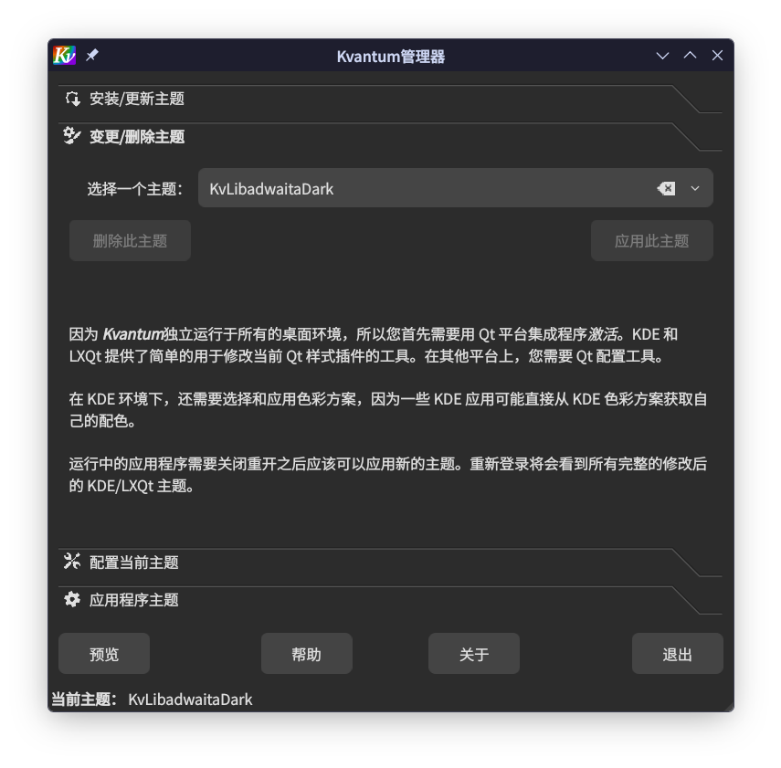
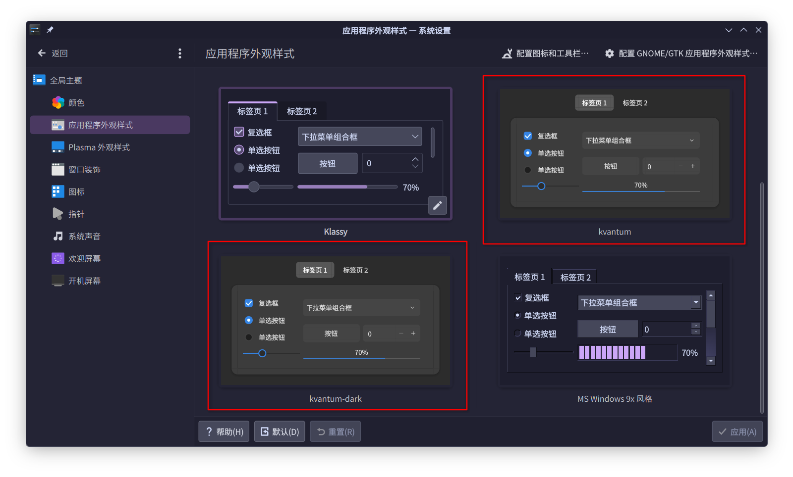
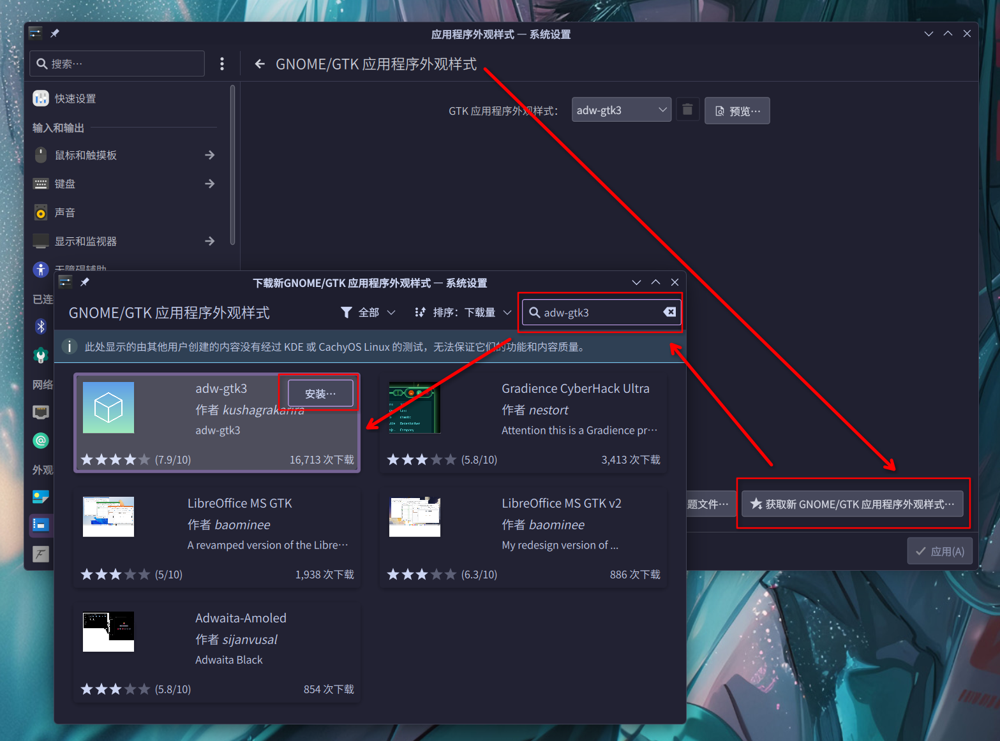

# 如何在 KDE Plasma 上获得 GNOME 的应用样式

> 2026-08-18

我是 KDE Plasma 用户，但是我还是很喜欢 GNOME 那种应用样式的，那我们何不试试折腾一下呢（

:::info

GNOME 那种 GTK 样式是由 `libadwaita` 库提供的，但**并不是 Adwaita**（那是曾经使用的旧版样式，如果你用过 Inkscape 的话它的默认样式就是 Adwaita）

这个命名...挺奇怪的（

:::

我们都知道Linux上的主流桌面应用图形库是 Qt 和 GTK，所以我们要为它们两个分别安装两款主题：

## Qt - KvLibadwaita

首先，我们需要安装 Kvantum，这是一个基于 SVG 的 Qt 样式引擎，我们要的主题就基于它。

按照 [Kvantum 的安装指南](https://github.com/tsujan/Kvantum/blob/master/Kvantum/INSTALL.md) 安装即可，例如在 Arch 上：

```bash
sudo pacman -S kvantum
```

### 安装

接下来就可以安装 [KvLibadwaita](https://github.com/GabePoel/KvLibadwaita) 了。我用的是 CachyOS，它的官方仓库里有这个主题，可以直接安装：

```bash
sudo pacman -S kvantum-theme-libadwaita-git
```

对于其他 Arch 系发行版，就需要从 AUR 安装：

```bash
paru -S kvantum-theme-libadwaita-git
```

其他发行版的话可以用官方安装脚本：

```bash
git clone https://github.com/GabePoel/KvLibadwaita.git
cd KvLibadwaita
./install.sh
```

### 应用

打开 Kvantum Manager，在“变更/删除主题”一栏中选择 `KvLibadwaita` 或 `KvLibadwaitaDark`，并点击“应用此主题”：



接下来打开 KDE 系统设置，转到颜色和主题 > 应用程序外观样式，选择 Kvantum 并应用即可



## GTK - adw-gtk3

[adw-gtk3](https://github.com/lassekongo83/adw-gtk3) 是一个仿 `libadwaita` 的 GTK3 样式。

Arch 的 extra 仓库已经包含了这个主题，所以可以直接安装：

```bash
sudo pacman -S adw-gtk-theme
```

也可以在刚才的应用程序外观样式页面里点击右上角的“GNOME/GTK 应用程序外观样式”，并进入搜索下载：



在 [adw-gtk3 的 KDE Store 页面](https://store.kde.org/p/1779168) 上有其他发行版的安装说明。

然后同样是在“GNOME/GTK 应用程序外观样式”页面中，在上面的下拉框里选择 `adw-gtk3` 或 `adw-gtk3-dark` 并应用即可。

## 写在最后

样式的实时应用不太完全，建议重新登录或者重启一下。

这两款主题还是有一些细微差别（比如二者的 Tabs 样式不同），就我而言我认为 KvLibadwaita 更还原一点。

第一篇文章就写到这吧awa
